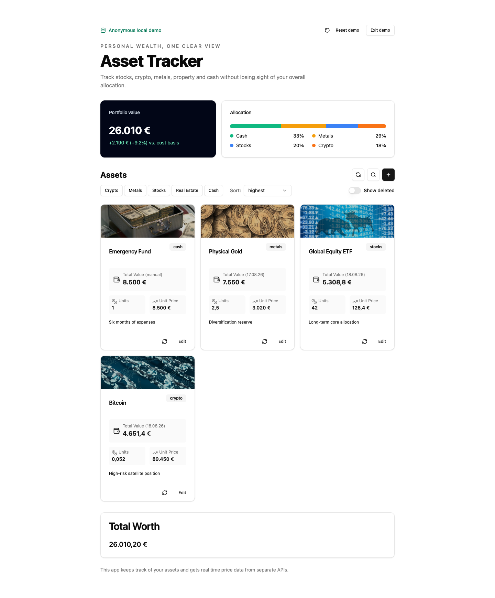
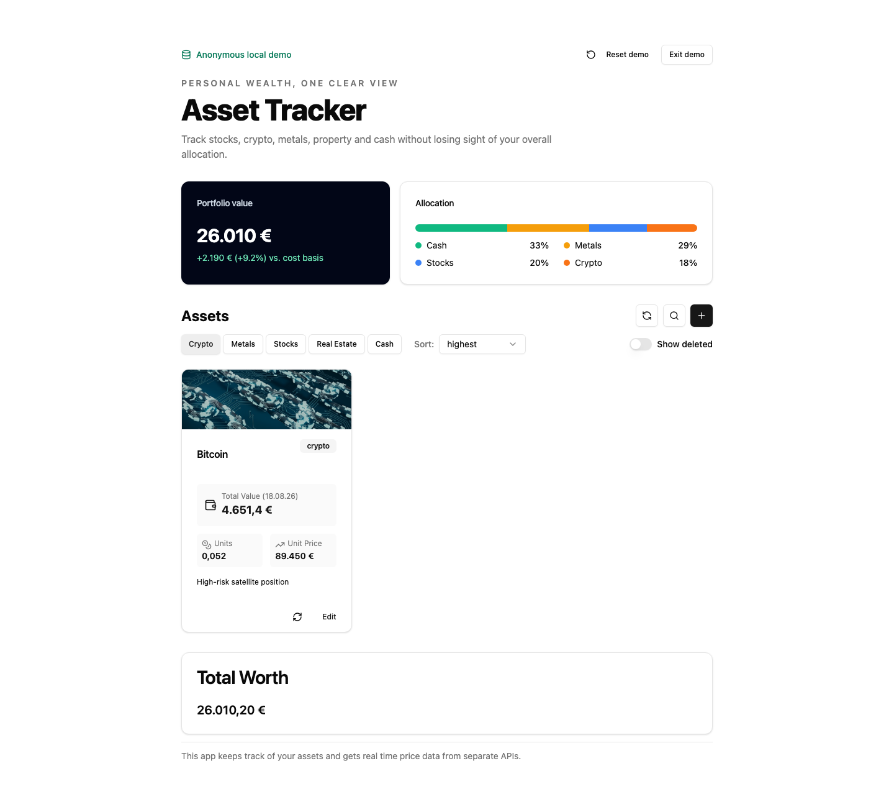
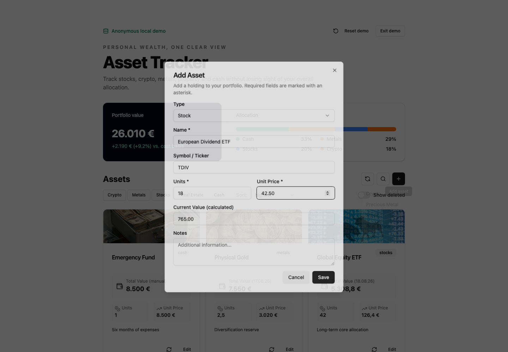
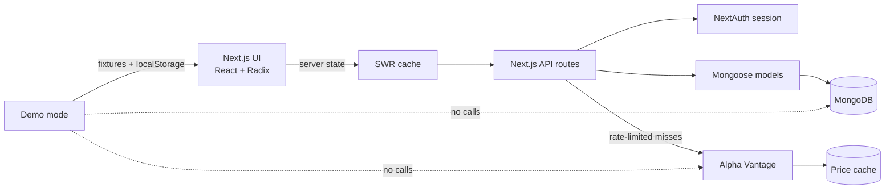

# Asset Tracker

A full-stack portfolio tracker for stocks, crypto, precious metals, real estate and cash.

[](https://asset-tracker.samuelgesang.de/?demo=true)
[](https://github.com/gcode-de/Asset-Tracking/actions/workflows/quality.yml)

**[Try the anonymous interactive demo →](https://asset-tracker.samuelgesang.de/?demo=true)**

The showcase uses bundled, anonymized data and stores changes only in local storage. It needs no account, MongoDB connection or Alpha Vantage request, so the complete create/filter/edit journey remains reliable even when external services are unavailable.



## Problem and audience

Personal wealth is often spread across brokers, wallets, metals, property and cash, making total value and allocation difficult to understand. Asset Tracker gives self-directed investors one focused place to maintain those holdings and compare current value with their cost basis. It is designed for people who need a lightweight overview rather than an order-execution or accounting platform.

## Product capabilities

- Create, edit, soft-delete, restore, filter and sort holdings across five asset classes.
- See total portfolio value, cost-basis performance and allocation at a glance.
- Search supported instruments and cache market prices for signed-in portfolios.
- Explore every critical interaction in an independent demo with deterministic data.
- Use keyboard-accessible Radix dialogs, labelled controls and announced loading/error states.

## Screens

| Filtered portfolio | Add or edit a holding |
| --- | --- |
|  |  |

Screenshots are generated from the local demo with `npm run docs:screenshots` while the development server is running.

## Architecture



The Pages Router keeps UI and server endpoints in one deployable Next.js application. Authenticated requests resolve the user from the server session; the demo takes an intentionally separate client-only path.

## Technical decisions

### Price caching

Market prices live in a dedicated `Price` collection and are upserted by normalized symbol. Holdings reference the latest cached value first, while Alpha Vantage is called only by the explicit refresh flow; this keeps the portfolio readable when the provider is slow or unavailable and prevents duplicate price documents.

### Rate limiting

`ApiCounter` stores a daily count keyed by date and a SHA-256 identifier of the API key. The server checks the counter before each refresh, stops on provider throttling and exposes remaining calls to the UI, protecting the 25-request free-tier budget across users.

### Mongoose models

Small, user-owned holdings are embedded in the `User` document so a portfolio is loaded and updated as one aggregate. Cross-user price data and the API counter use separate indexed models because they have independent lifecycles and can be shared without weakening user isolation.

### Server and UI state

SWR owns remote user, price and counter data and revalidates it after mutations. React state owns short-lived concerns such as filters, sort order and dialog state; demo holdings are the sole exception and are persisted to local storage to keep the public showcase deterministic and infrastructure-free.

## Quality strategy

| Layer | Coverage |
| --- | --- |
| Vitest + React Testing Library | Performance/allocation calculation, filter interaction, accessible asset editing and calculated values |
| Playwright | Demo entry → create asset → filter → edit → verify recalculated value |
| GitHub Actions | ESLint, TypeScript, component tests, production build and Chromium E2E |

Run the same checks locally:

```bash
npm run lint
npm run typecheck
npm test
npm run test:e2e
npm run build
```

## Local setup

Requirements: Node.js 22+, npm, MongoDB and an Alpha Vantage key for live price refreshes.

```bash
git clone https://github.com/gcode-de/Asset-Tracking.git
cd Asset-Tracking
npm ci
cp .env.example .env.local
npm run dev
```

Create `.env.local` with the services you want to enable:

```dotenv
MONGODB_URI=mongodb://localhost:27017/asset-tracker
NEXTAUTH_URL=http://localhost:3000
NEXTAUTH_SECRET=replace-with-a-random-secret
GITHUB_ID=
GITHUB_SECRET=
GOOGLE_ID=
GOOGLE_SECRET=
ALPHAVANTAGE_KEY=
```

The interactive demo at `http://localhost:3000/?demo=true` works without any of these values. Live accounts require MongoDB, a NextAuth secret and at least one configured OAuth provider; Alpha Vantage is required only for instrument search and price refresh.

## Repository map

```text
src/
├── components/       UI primitives and product components
├── db/models/        User, Price and ApiCounter schemas
├── lib/demo.ts       anonymized showcase fixtures and local persistence
├── pages/api/        authenticated portfolio and market-data endpoints
└── pages/index.tsx   live/demo orchestration and product states
e2e/                  Playwright critical journey
docs/screenshots/     reproducible README media
.github/workflows/    CI quality gates
```

## Deployment

The application is deployed on Netlify. Production needs the same environment variables as local live mode; the demo route remains operational independently of MongoDB and Alpha Vantage.
